[Hystrixを説明してみた](../001_hystrix_01/) の続き

# Hystrixの機能

Hystrixの機能紹介をしてみる。

* コマンド隔離
* コマンドエラー検知
    * 例外ハンドリング
    * タイムアウトハンドリング
* コマンド同時実行数制限

## コマンド隔離

Hystrixではコマンドの隔離が行える。  
具体的には、指定したメソッド一つが隔離対象となり、別名で隔離したメソッドと影響しあわないようにできる。

例えば、以下のように2つのコマンドを定義したアプリの場合。
コマンドAからアクセスするAPIAがタイムアウトを頻発するような状況になってしまったとすると、  
コマンドAが即エラーを返すようなることで、リクエスト処理スレッドが占有されず、コマンドBは正常に処理が行われる。

## コマンドエラー検知

コマンド内で実行される処理でExceptionが発生した場合には、このExceptionを検知してフォールバック処理を行うことができる。

また、コマンド内の処理のタイムアウトを測ることができ、指定時間を過ぎた場合に、HystrixのExceptionを発生させることができる。

timeInMillisecondsの秒数内に、numBuckets分の記録用の箱があるイメージ。
例えば、10,000msで10Bucketsの場合、集計範囲は1,000msになる。

circuitBreaker.errorThresholdPercentageで設定した割合でSuccess以外のエラー数となった場合に、ショートサーキット状態となる。

参考：[GitHub - Netflix/Hystrix wiki](https://github.com/Netflix/Hystrix/wiki/Configuration#metricsrollingstatstimeinmilliseconds)

## コマンド同時実行数制御

隔離されたコマンドは同時実行数の制御が行える。

Hystrixは隔離方式を2種類用意しており、デフォルトでは独立Threadによる制御を行う。

もう一つの制御方法として、セマフォ方式を持っている。

若干飽きて適当になった（ぇ

いったんこれまでにしておく。
