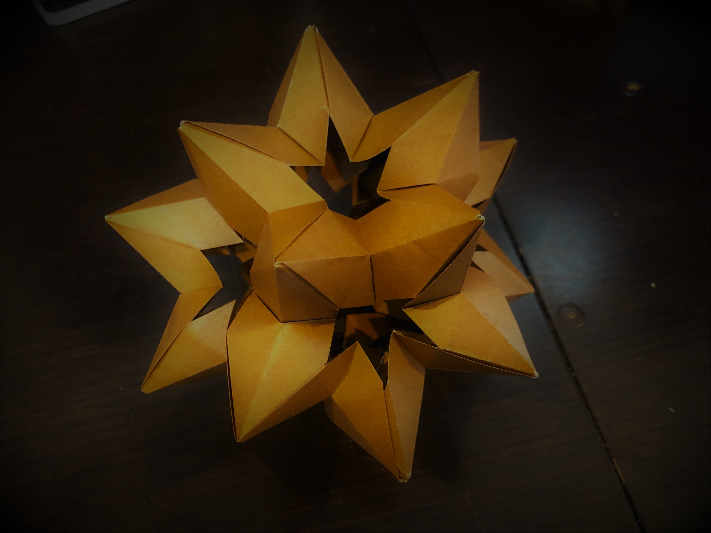

## ユニット折り紙

イライラ、もやもやしたときにいつも作るユニット折り紙を並べて行こうという試み。

今回、いつも使っているユニット折り紙の本以外から情報を得て作ったので、作り方を残しておくというのもある。

## 完成図

## 作り方

思ったよりも、Draw.ioで折り紙書くの辛かった（何

折り紙の図面は表裏がわかるように範囲色付けとか、変形させた際に微調整をするために、線同士の結合をしたまま移動させるとかの機能があったほうがいい。。。  
つまり、ちゃんとしたお絵かきソフトで作ったほうが断然効率がいいということが分かったorz

でもちょっと面白かった
