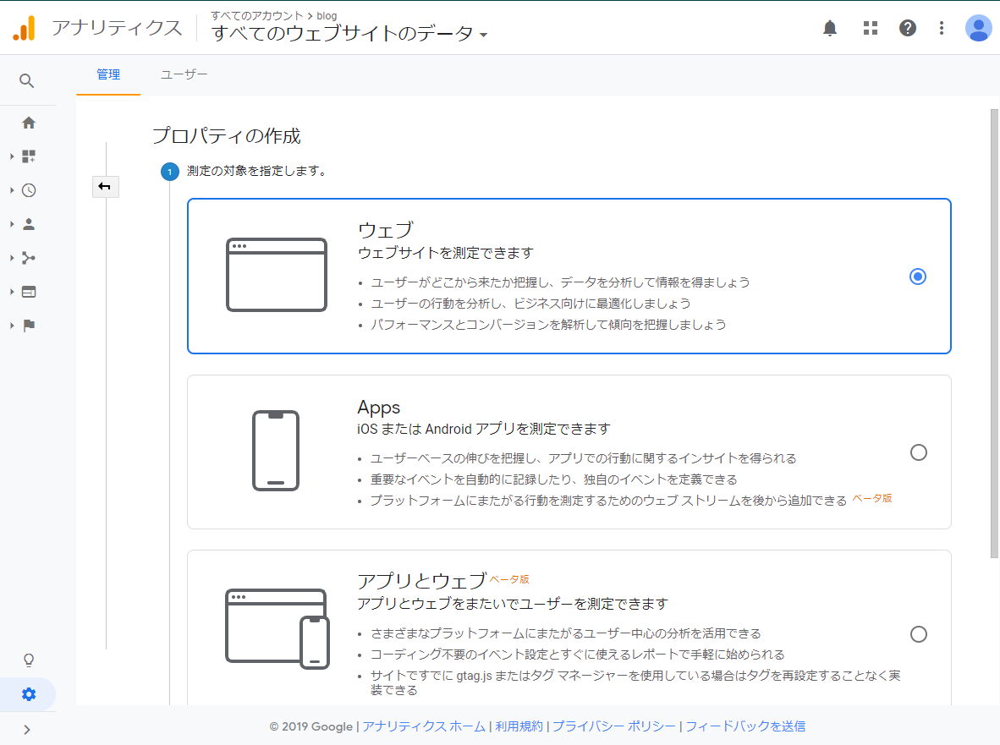
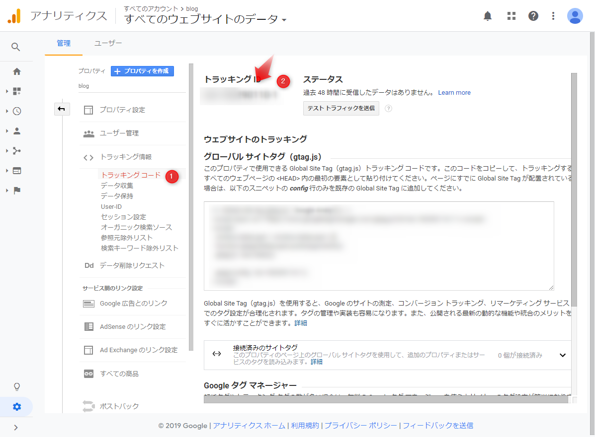

とりあえずgoogle analyticsが標準対応との記述を[公式ドキュメント](https://gohugo.io/templates/internal/#google-analytics)で見つけたのでやっておく。

## 1. google analyticsにログイン
## 2. 新規プロパティを作成



### ハマったこと

ウェブを選択。  
アプリとウェブだとうまくできなかった（よくよめよ）

## 3. トラッキングIDをコピー

プロパティのメニューから選ぶ



## 4. `config.toml` に追加

``` config.toml
baseURL = "https://shibadog.github.io/"
languageCode = "ja-jp"
title = "shibadog site"
theme = "hermit"

googleAnalytics = "UA-999999999-9"

[author]
  name = "shibadog"
:
:
```

## 参考
* [AGO's page - hugoにgoogle アナリティクスを導入した話](https://agodoriru.github.io/post/20171218/)
* [なかけんのHugoノート - 画像を追加しよう](https://hugo.nakaken88.com/use/image/)
